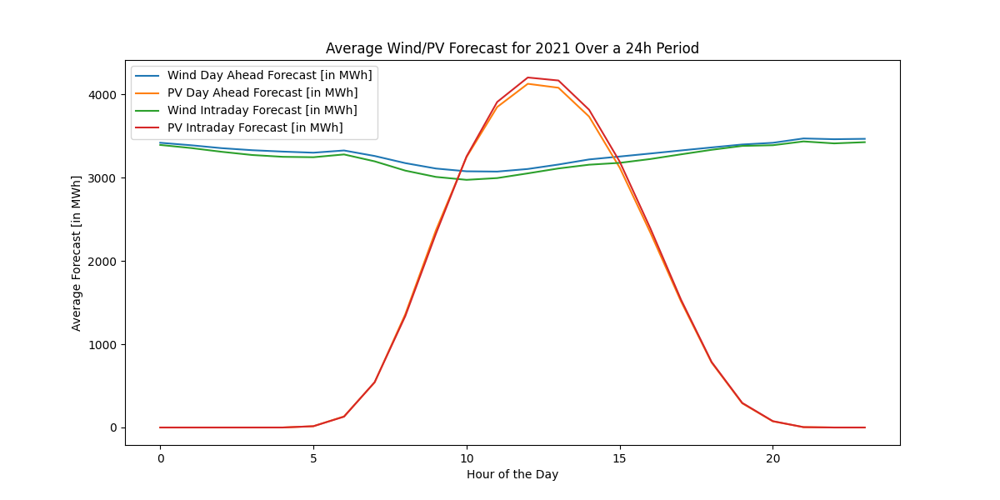

# FlexPower - Quant Challenge: Application for an internship

## Introduction
The Tasks are done in two seperate .py files, [task 1](task1.py) and [task 2](task2.py). In this document I will give an overview of my results only, so they are more readable.

## Task 1: Minimal Reporting Tool
### Task 1.1
The total by volume is 28 and the total sell value 53. 

### Task 1.2
The Profit and Loss for strategy 1 is -50 and for strategy 2 is 548. Any other strategy will return 0, as asked in the task.

### Task 1.3
You can see, how I tried to solve the API-question in my code. Although I have never exposed a function as an API before, so I don't know, whether this is what you wanted.

## Task 2: Data analysis and building a trading strategy
### Task 2.1
After the conversion of MW in quarter hour to MWh, we get: 

Total Wind forecasteded Day Ahead:  115395406.25

Total Wind forecasteded Intraday:  113478034.5

Total PV forcasteded Day Ahead:  46094572.75

Total PV forcasteded Intraday:  46689891.5

### Task 2.2

### Task 2.3
Average Wind Value [in EUR/MWh]:  81.38706977035753

Average PV Value [in EUR/MWh]:  76.89453079034125

The average value of Wind and PV is lower than the average day ahead price. I can think of some reasons for this: 1. there might be forcasting inaccuracies, that affect the price 2. the average day ahead price is calculated over all hours, while the average value of Wind and PV is calculated over the forecasted production (being a volume weighted average) 3. there might be issues with oversupply during certain hours. To asses these closer, I would need to look at the data in more detail.

### Task 2.4
Day with the highest renewable energy production:  2021-03-12

Total Renewable Energy Production on this day:  1088041.0

Average Day Ahead Price on this day:  22.28625

Day with the lowest renewable energy production:  2021-11-16

Total Renewable Energy Production on this day:  59199.25

Average Day Ahead Price on this day:  237.465

On the day with the highest renewable energy production, the da price is low, as the supply of energy is high. On the other hand, if there is low production (or forcasted prodcution), the price of energy tends to be high.

### Task 2.5
Average Day Ahead Price during Weekdays:  104.36723180076628

Average Day Ahead Price during Weekends:  77.96704540830547

The average price during the weekdays is higher than during the weekends. This could be due to the fact that the demand for energy is higher during the weekdays, as people are at work and the industrial production (for example) is using more energy.

### Task 2.6
My idea here is to look at the Intraday Quarterhourly Price markets (aussuming that our battery can be charged and discharged again quickly). I calculated the lowest average price, which turned out to be at 4 o'clock and 64.798 EUR/MWh, as well as the highest average price, which was 135.5699 at 20 o'clock. This is likely due to suplly and demand. If we have a battery we can use it to fill part of this demand, buying energy at 4 and selling again at 20.

If we actually used this strategy, the battery would have generated 25831.525 EUR in 2021 (ignoring some things like trading fees, energy loss and so on).

### Task 2.7
