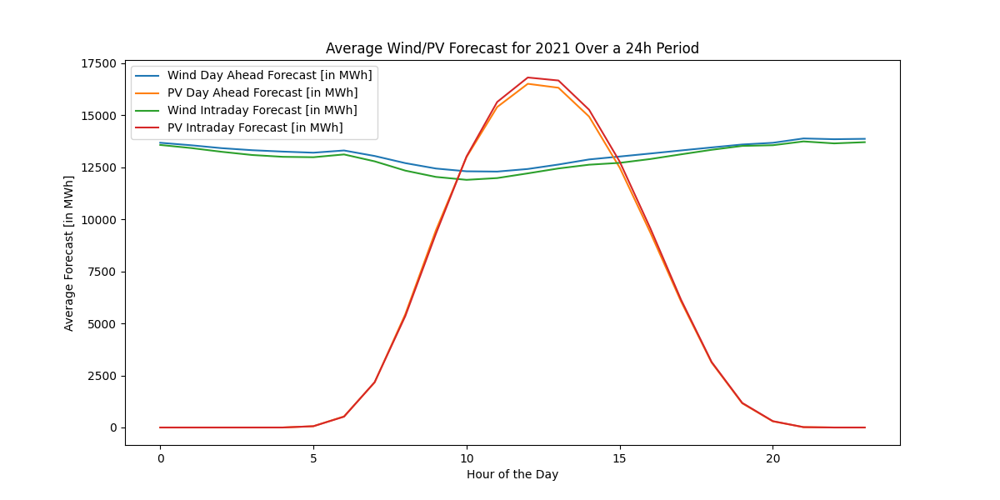
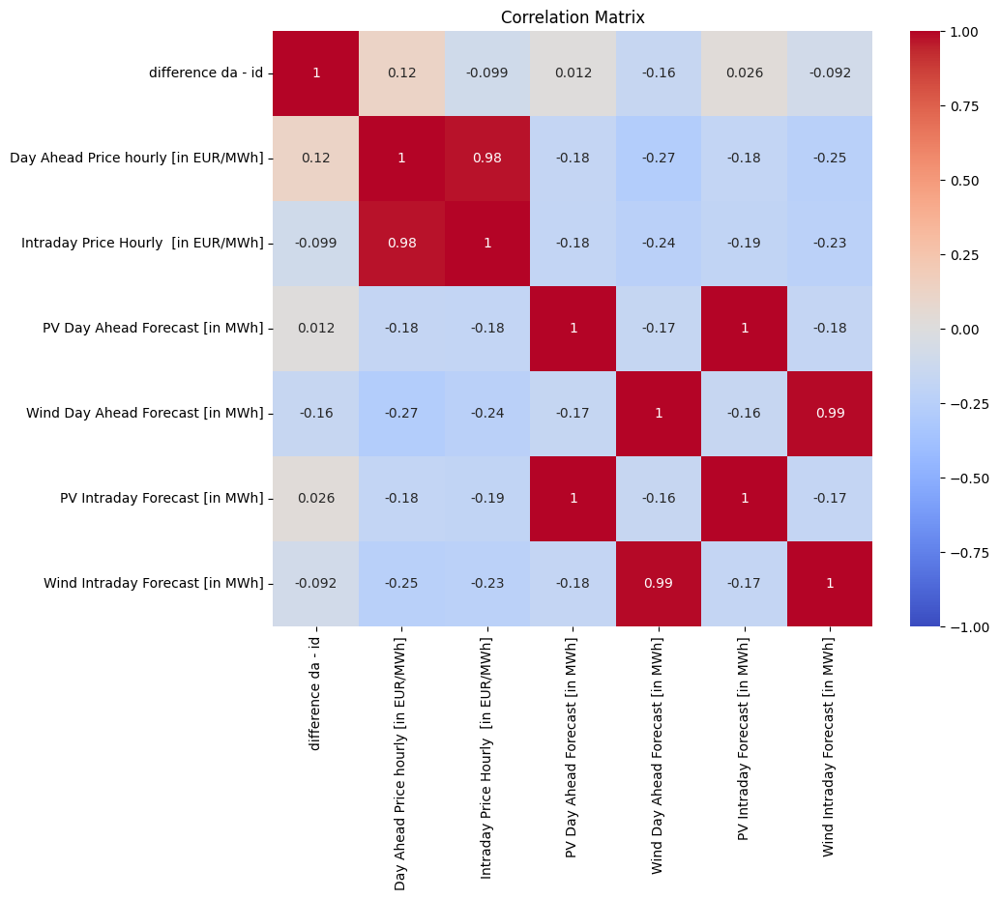
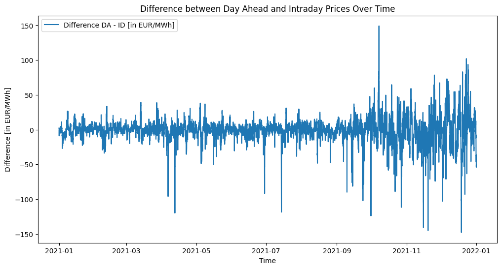
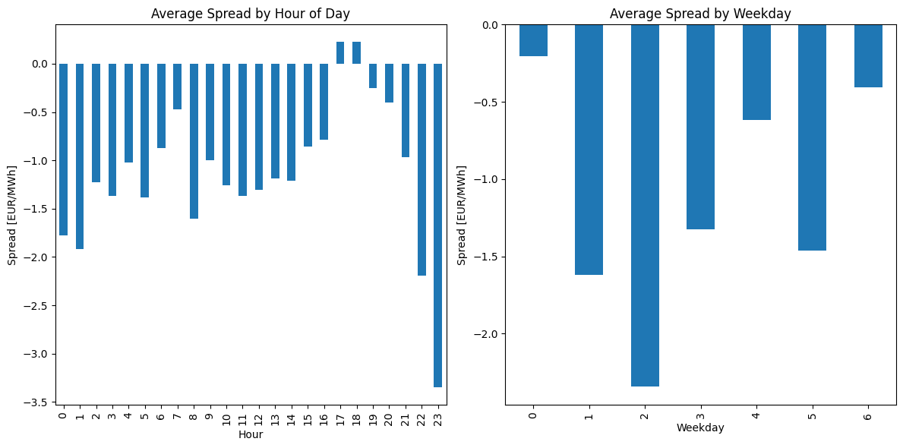
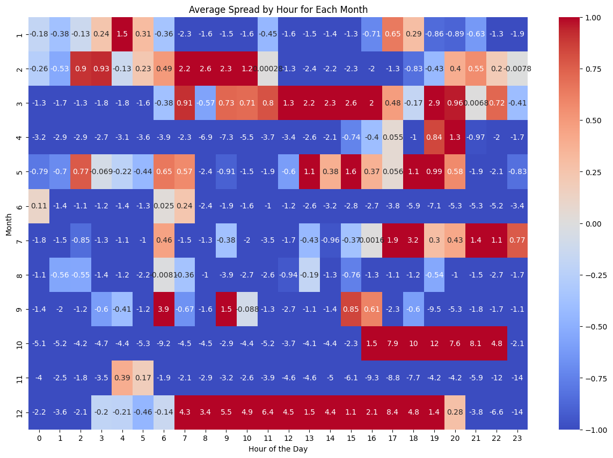
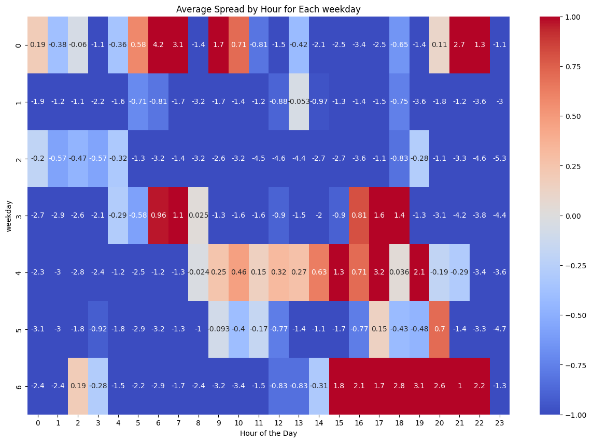
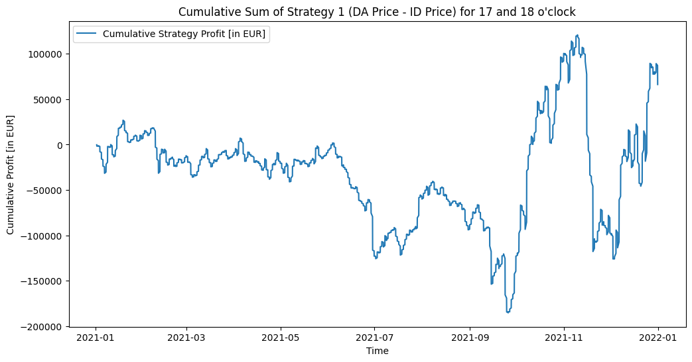
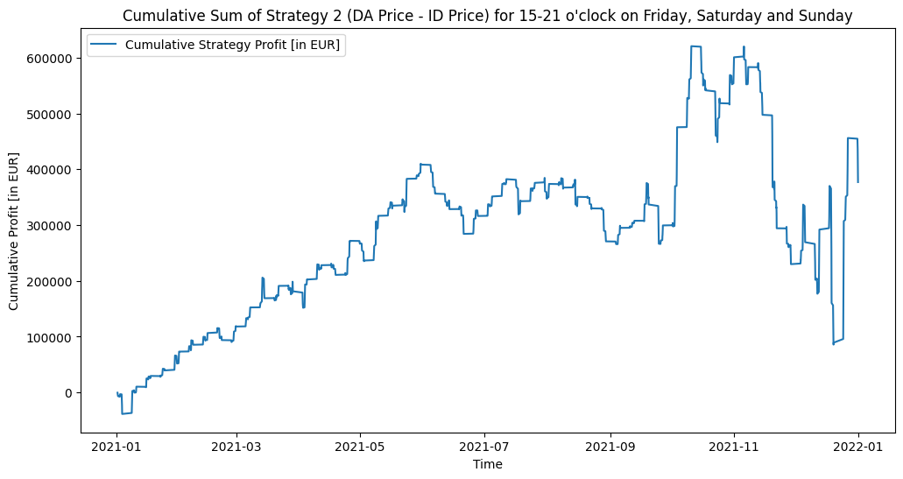

# FlexPower - Quant Challenge: Application for an internship

## Introduction
The Tasks are done in two seperate .py files, [task 1](task1.py) and [task 2](task2.py). In this document I will give an overview of my results only, so they are more readable.

## Task 1: Minimal Reporting Tool
### Task 1.1
The total by volume is 28 and the total sell value 53. 

### Task 1.2
The Profit and Loss for strategy 1 is -50 and for strategy 2 is 548. Any other strategy will return 0, as asked in the task.

### Task 1.3
You can see, how I tried to solve the API-question in my code. Although I have never exposed a function as an API before, so I don't know, whether this is what you wanted.

## Task 2: Data analysis and building a trading strategy
### Task 2.1
After the conversion of MW in quarter hour to MWh, we get: 

Total Wind forecasteded Day Ahead:  115395406.25

Total Wind forecasteded Intraday:  113478034.5

Total PV forcasteded Day Ahead:  46094572.75

Total PV forcasteded Intraday:  46689891.5

### Task 2.2

### Task 2.3
Average Wind Value [in EUR/MWh]:  81.38706977035753

Average PV Value [in EUR/MWh]:  76.89453079034125

Average Day Ahead Price [in EUR/MWh]:  96.84991780821919

The average value of Wind and PV is lower than the average day ahead price. I can think of some reasons for this: 1. there might be forcasting inaccuracies, that affect the price 2. the average day ahead price is calculated over all hours, while the average value of Wind and PV is calculated over the forecasted production (being a volume weighted average) 3. there might be issues with oversupply during certain hours. To asses these closer, I would need to look at the data in more detail.

### Task 2.4
Day with the highest renewable energy production:  2021-03-12

Total Renewable Energy Production on this day:  1088041.0

Average Day Ahead Price on this day:  22.28625

Day with the lowest renewable energy production:  2021-11-16

Total Renewable Energy Production on this day:  59199.25

Average Day Ahead Price on this day:  237.465

On the day with the highest renewable energy production, the da price is low, as the supply of energy is high. On the other hand, if there is low production (or forcasted prodcution), the price of energy tends to be high.

### Task 2.5
Average Day Ahead Price during Weekdays:  104.36723180076628

Average Day Ahead Price during Weekends:  77.96704540830547

The average price during the weekdays is higher than during the weekends. This could be due to the fact that the demand for energy is higher during the weekdays, as people are at work and the industrial production (for example) is using more energy.

### Task 2.6
My idea here is to look at the Intraday Quarterhourly Price markets (aussuming that our battery can be charged and discharged again quickly). I calculated the lowest average price, which turned out to be at 4 o'clock and 64.798 EUR/MWh, as well as the highest average price, which was 135.5699 at 20 o'clock. This is likely due to suplly and demand. If we have a battery we can use it to fill part of this demand, buying energy at 4 and selling again at 20.

If we actually used this strategy, the battery would have generated 25831.525 EUR in 2021 (ignoring some things like trading fees, energy loss and so on).

### Task 2.7

What we are interested in, is the difference between the day ahead and the intraday hourly prices. We have excess to the day ahead data (pv and wind forecasts as well as the day ahead prices) and then we need to make decisions on whether to buy energy to those prices.

The winter looks to have much more volatility between the intraday price vs the day ahead price. Although we can see some big spikes over the whole year for the spread in both directions. 

One idea would be to just buy 17 and 18 o'clock every day. This seems to be, an average, the only time, where we get a positive spread between day ahead and the intraday prices. When we consider the hours, by each month, we can see the pattern that in certains months (december, october, july, may, march as well as january and february) have blocks of hours where the average spread is positive. But it would be hard to justify, just from this data, why these months should be chosen (it isn't claer that this strategy would also work for example for 2022 and we can't overfit a strategy on old data). 

Maybe we can see that there are some inefficiencies when it comes to the demand on the weekends (fridays, saturdays and sundays) where the dayahead price underestimates the demand in the evenings.

I tried to find a way to implement the forecasted values for wind and pv. The correlation with the day ahead PV forecast is positive, but with the day ahead wind forecast is actually negative. There is probably a more complex algorithm to explore a strategy here that uses intelligent forecast signals. In the restricted time I had for this excercise, I couldn't come up with one that seemed to work (without overfitting to my testing data in a way that doesn't seem logical to me). 

So I tried two strategies: 

1.Buying and selling 17 and 18 o'clock every day.

Here we assume that we always buy and sell 100 MW (this skips over questions of loosing part of our capital and so on). This strategy would actually make a profit of 66000 EUR over the year. As we can see in the graph though it has quite a lot of volatility. We could probably do better by adding indicators for how big to size our position. This strategy is probably not very good in the real world. We are trying very hard to fit our data and we don't account for any trading fees and so on. 

2.Buying and selling fridays, saturdays and sundays from 15 to 21 o'clock.

We still assume we always risk our entire portfolio on a sigles trade (obv. this is not a good idea due to risk management). This strategy gives us a more reliable profit curve and (probably) exploits misspricing of energy on the evening of "weekend days", where demand is expected to be lower, but it seems like more often then not it turns out to be higher. This strategy gives a profit of 376906 EUR for the year. Excluding fees, taxes and so on.

As described above the stragies are very rudimentary, we obviously need to implmenet some form of risk managment (this just assumes that we use the whole portfolio to trade this strategy, because we have a number of portfolios doing different things). This would include the sizing of our position optimally including indicators like the forecasted wind and pv production.

I hope, I was able to show some of my coding skills. I have to say that I am not too happy with how Task 2.7 turned out, as I would have liked to find a better trading strategy. But this is what I have been able to come up with in the short timeframe, that I was given. Additionally more knowledge about the energy market would be very helpful to be able top draw connections quicker and come up with more interesting hypothesis. 